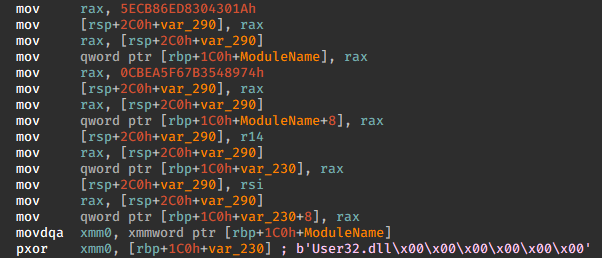

# IDA Xorstr Decryption Plugin
- Attempts to decrypt obfuscated strings in x64 windows binaries using https://github.com/JustasMasiulis/xorstr
- Only tested on a few projects, can be hit or miss
- Tested on IDA 8 and IDA 7.5

## Usage
1. Put xorstr_decrypt.py into <IDA_DIR>/plugins/
2. Open a binary in IDA and load the plugin directly (Edit > Plugins > Xorstring Decryptor), or simply press *Alt + F8*